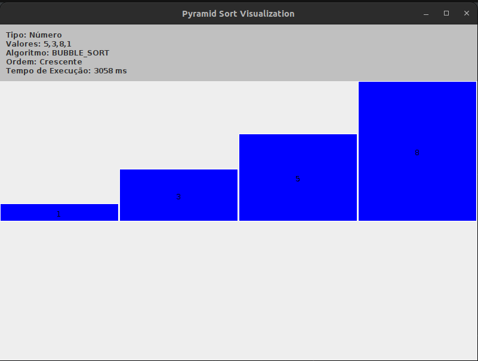
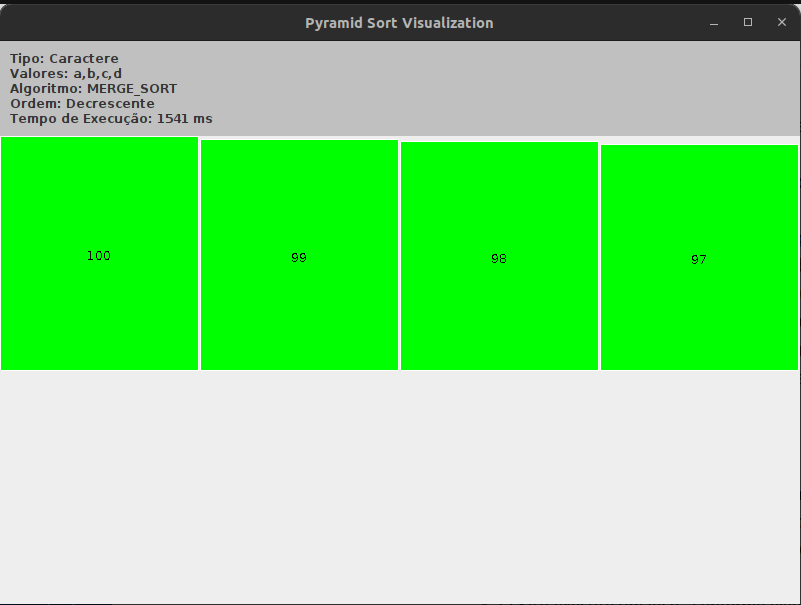
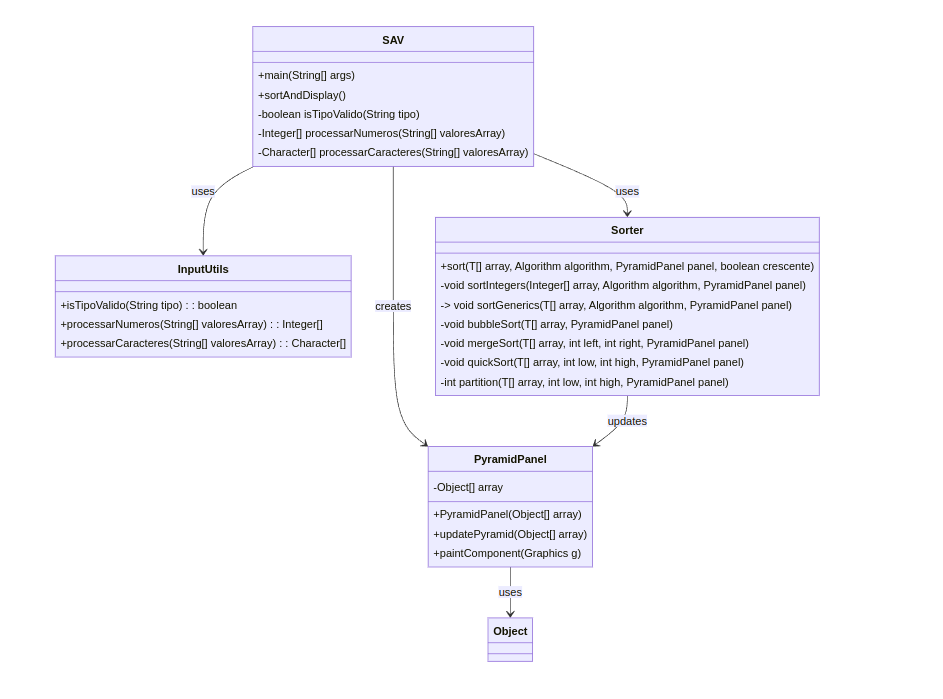

# Sorting Algorithm Visualizer (SAV)

Aplicação Java com interface gráfica em Swing para visualizar algoritmos de
ordenação. Os valores são exibidos como barras e atualizados durante cada etapa
da ordenação.

## Funcionalidades

- Ordenação de números inteiros e caracteres
- Ordens crescente e decrescente
- Visualização de Bubble Sort, Merge Sort e Quick Sort
- Exibição do tempo de execução

## Requisitos

- JDK 8 ou superior

## Como executar

Compile as classes na raiz do projeto:

```bash
javac -d out src/*.java
```

Execute a aplicação informando exatamente quatro parâmetros:

```bash
java -cp out SAV t=<tipo> v=<valores> a=<algoritmo> o=<ordem>
```

Parâmetros disponíveis:

| Parâmetro | Valores |
| --- | --- |
| `t` | `n` para números ou `c` para caracteres |
| `v` | valores separados por vírgulas |
| `a` | `BUBBLE_SORT`, `MERGE_SORT` ou `QUICK_SORT` |
| `o` | `c` para crescente ou `d` para decrescente |

### Exemplos

Números em ordem crescente com Bubble Sort:

```bash
java -cp out SAV t=n v=5,3,8,1 a=BUBBLE_SORT o=c
```



Caracteres em ordem decrescente com Merge Sort:

```bash
java -cp out SAV t=c v=a,b,c,d a=MERGE_SORT o=d
```



## Estrutura do projeto

- `SAV`: inicia a aplicação e processa os parâmetros
- `InputUtils`: valida e converte os valores recebidos
- `Sorter`: implementa os algoritmos de ordenação
- `PyramidPanel`: desenha e atualiza a visualização

## Fluxo da aplicação


