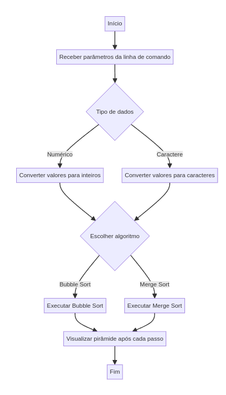

# Projeto de Ordenação com Visualização em Pirâmide

Este projeto implementa a ordenação de arrays de números inteiros ou caracteres usando algoritmos de ordenação e visualiza o progresso da ordenação em um gráfico estilo pirâmide. O projeto utiliza dois algoritmos de ordenação: Bubble Sort e Merge Sort.

## Funcionalidade

- Recebe parâmetros da linha de comando para tipo de dado (numérico ou caractere), valores a serem ordenados e o algoritmo de ordenação a ser usado.
- Exibe a lista ordenada como uma pirâmide, onde a altura da pirâmide é determinada pelo maior valor no array e a largura é igual ao número de elementos.
- Visualiza a evolução da ordenação com um atraso entre as atualizações para melhor compreensão do processo.

## Uso

### Sintaxe do Comando

```sh
java SAV t=<tipo> v=<valores> a=<algoritmo>
```
- t=<tipo>: Tipo de dados a ser ordenado. Use n para numérico e c para caractere.
- v=<valores>: Valores a serem ordenados, separados por vírgulas. Exemplo: 5,3,8,1,2 para números e z,a,Z,A,b para caracteres.
- a=<algoritmo>: Algoritmo de ordenação a ser usado. Use BUBBLE_SORT ou MERGE_SORT.
### Exemplos
Ordenação de números usando Bubble Sort:

```sh
java SAV t=n v="5,3,8,1,2" a=BUBBLE_SORT
```

Ordenação de caracteres usando Merge Sort:
```sh
java SAV t=c v="z,a,Z,A,b" a=MERGE_SORT
```

## Algoritmos de Ordenação
- Bubble Sort
O Bubble Sort é um algoritmo simples de ordenação que compara pares adjacentes de elementos e os troca se estiverem na ordem errada. Este processo é repetido até que a lista esteja ordenada.

- Merge Sort
O Merge Sort é um algoritmo eficiente de ordenação que divide a lista em duas metades, ordena cada metade recursivamente e, em seguida, mescla as duas metades ordenadas.

## Visualização
A visualização dos valores é feita em um gráfico estilo pirâmide, onde a altura da pirâmide é igual ao maior valor no array e a largura é igual ao número de elementos. O gráfico é atualizado após cada passo da ordenação para mostrar o progresso.

## Fluxograma do Processo de Ordenação


## Requisitos
- Java 8 ou superior
- Compilação e Execução
- Para compilar e executar o projeto:

##Compile o código:
```sh
javac SAV.java Sorter.java
```
## Execute o programa com os parâmetros desejados:
```sh
java SAV t=n v="5,3,8,1,2" a=BUBBLE_SORT
```
## Licença
```
Este projeto é licenciado sob a MIT License. Veja o arquivo LICENSE para mais detalhes.
```